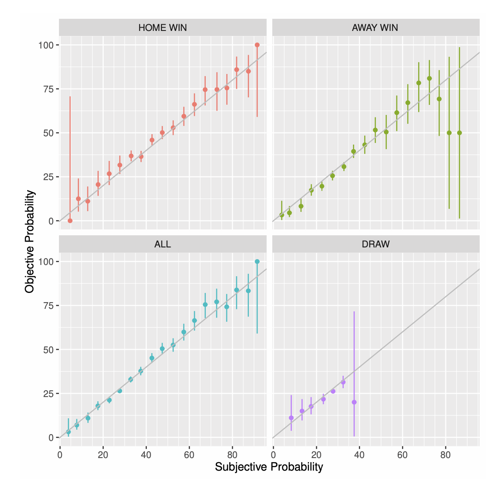
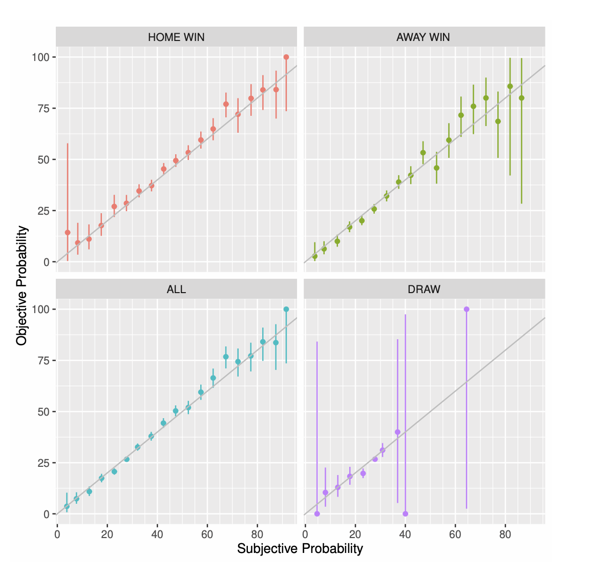
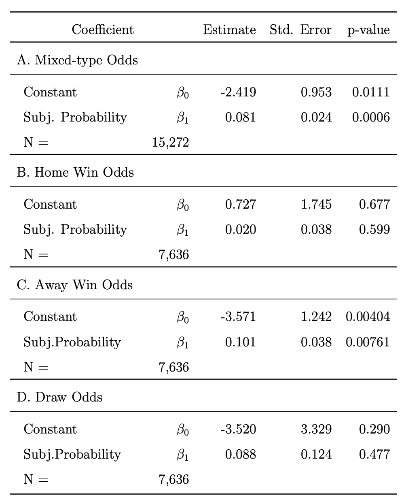

This research studies the favorite-longshot bias in the European online football betting markets.

## Data
We measured the favorite--longshot bias in match betting data (also called 1X2 or three-way betting) of 11 European football competitions from 28 different bookmakers. 7669 matches played in 11 well-known football leagues during season 2016/17 and 2017/18 were included in the data with the following information:

- Match results: The match results were pulled from www.worldfootball.net website. Each data point consisted of the date and time of the match, the team names, and the final score of the match. The final score was used to define which team won that specific game. 

- Associated odds: The match results were associated with the odds on www.oddschecker.com website based on the match's date and time and the team names. The odds data was given by Marko Terviö, my thesis supervisor. Each data point included the date and time when the data is recorded, the date and time of the matches, the team names, and the odds offered for a result of the victory of either the home or away team, or draw by different bookmakers. 

## Goals
We tried to answer the following questions in this project:
1. How well does the European online football betting market perform as a prediction market? In other words, how accurately do the odds provided by the bookmakers in these markets can predict the match results or the actual winning probabilities?

2. Is there a favorite--longshot bias in these betting markets? Is the bias varied when the team is playing at home or away position? What is the magnitude of this favorite--longshot bias if it exists?

## Tools
- R

## Selected Results

The overall result is that the European online football betting market is quite efficient. The odds provide good prediction for match results. Also, statistically, there is no clear evidence that the favorite--longshot bias exists in the data. Some selected results from the project are presented below.

### Subjective probability implied by odds vs Objective probability derived from actual results

  
   

The figures above present the objective and subjective probability points of different categories with 45-degree lines. The objective probabilities were estimated base on the actual outcome of the matches in each category. The categories were constructed by dividing the subjective probabilities into 19 groups with a step of 5%: 0-5%, 5-10%, ..., 90-95% (no subjective probability higher than 95% in the data). In the left figure, the subjective probabilities were calculated the average subjective probabilities implied by the odds 7 days before the matches. In the right figure, they were calculated similarly but with the odds on the day when the matches happened.  

The points above (or below) the lines depict categories where the subjective probability is lower (or higher) than the estimated objective probability. The horizontal line segments describe the 95% confidence intervals of the estimated objective probabilities. As the points are quite close to the 45-degree lines, the results indicate that the subjective probability is a good predictor of the objective probability.

### Regression analysis
To test for the existence of favorite-longshot bias as a whole, we used the following standard linear regression:

Result − p = β0 + β1p + ε

The variable “Result” is equal to 1 if the event that is wagered on happened and 0 if it did not. The variable "p" is the normalized subjective probability implied by the median of odds. In the absence of any bias, the coefficients would be β0 = 0 and β1 = 0. Meanwhile, the favorite-longshot bias would be indicated by β0 < 0 and β1 > 0. Two t-tests were conducted to test the hypotheses that β0 = 0 and β1 = 0. 

The regression was conducted in 4 sample groups: mixed types, home win odds, away win odds, and draw odds. The first group is constructed by dropping draw odds. The regression results are showed in the following table:

  

p-value is the unadjusted p-value for t-test that β0 = 0 and β1 = 0. With correction for multiple testing by multiplying p-value by 4, all adjusted p-values are larger than 0.05. Thus, we cannot reject the hypothesis that β0 = 0 and β1 = 0 at the 5% significance level. It means that the subjective and objective probabilities are not statistically different from each other. The favorite-longshot bias, therefore, is not observed in this data. 

